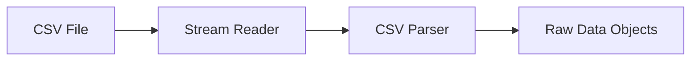

# ETL Project - CSV to Database Processor

## 📋 Project Overview

A robust **ETL (Extract, Transform, Load)** solution built with .NET that processes CSV files and efficiently loads data into SQL Server databases. The project follows modern software architecture principles with clear separation of concerns and dependency injection.

## 🏗️ Project Architecture

### Solution Structure
ETLProject/

├── ETL.Data/ # Class Library - Data Layer

│ ├── Models/ # Data transfer objects

│ ├── Services/ # Business logic & processing

│ ├── Utilities/ # Helper classes & extensions

│ └── Repository/ # Data access layer

└── ETL.Console/ # Console Application

├── Program.cs # Application entry point

├── appsettings.json # Configuration

└── DependencyInjection.cs


## 🚀 Key Features

### Data Processing
- **CSV Parsing**: Efficient streaming of large CSV files
- **Data Validation**: Comprehensive input sanitization and validation
- **Type Conversion**: Automatic handling of data type conversions
- **Duplicate Detection**: Intelligent duplicate identification and handling
- **Timezone Conversion**: EST to UTC timezone transformation

### Database Operations
- **Bulk Insertion**: High-performance batch database operations
- **Transaction Management**: Atomic operations with rollback capability
- **Connection Resilience**: Robust error handling and reconnection logic
- **Memory Efficiency**: Streaming processing for large files (10GB+)

### Security & Validation
- **SQL Injection Protection**: Parameterized queries via Dapper
- **Input Sanitization**: Malicious content detection and filtering
- **Data Integrity**: Constraint validation and data type safety
- **Resource Monitoring**: Memory and CPU usage tracking

## 🛠️ Technology Stack

### Backend Framework
- **.NET 6+** - Cross-platform runtime
- **C# 10** - Modern language features

### Data Access
- **Dapper** - High-performance micro-ORM
- **SQL Server** - Database engine
- **ADO.NET** - Underlying data access

### Processing & Utilities
- **CsvHelper** - CSV file parsing
- **Dependency Injection** - Built-in .NET IoC container
- **Configuration** - JSON-based app settings

## 📊 Data Flow

### Extraction Phase

### Loading Phase
```mermaid
graph LR
    A[Processed Records] --> B[Batch Processing]
    B --> C[Duplicate Check]
    C --> D[Bulk Insert]
    D --> E[Database]
    C --> F[Duplicates File]
